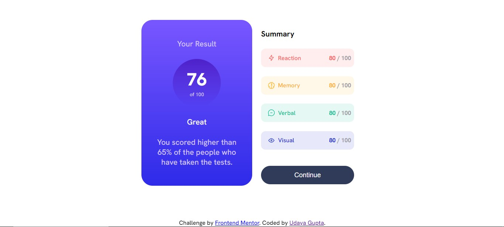

# Frontend Mentor - Results summary component solution

This is a solution to the [Results summary component challenge on Frontend Mentor](https://www.frontendmentor.io/challenges/results-summary-component-CE_K6s0maV). Frontend Mentor challenges help you improve your coding skills by building realistic projects. 

## Table of contents

- [Overview](#overview)
  - [The challenge](#the-challenge)
  - [Screenshot](#screenshot)
  - [Links](#links)
- [My process](#my-process)
  - [Built with](#built-with)
  - [What I learned](#what-i-learned)
- [Author](#author)

## Overview

### The challenge

Users should be able to:

- View the optimal layout for the interface depending on their device's screen size
- See hover and focus states for all interactive elements on the page

### Screenshot

 

## My process

### Built with

- Basic HTML5 markup
- CSS custom properties
- Flexbox

### What I learned

I learned how to handle the mobile design in this project although not perfectly but I can say that I am slightly getting the idea of how the mobile designed are made.

## Author

- Frontend Mentor - [@Udaya-Gupta](https://www.frontendmentor.io/profile/Udaya-Gupta)
- GitHub - [@Udaya-GUpta](https://github.com/Udaya-Gupta)

